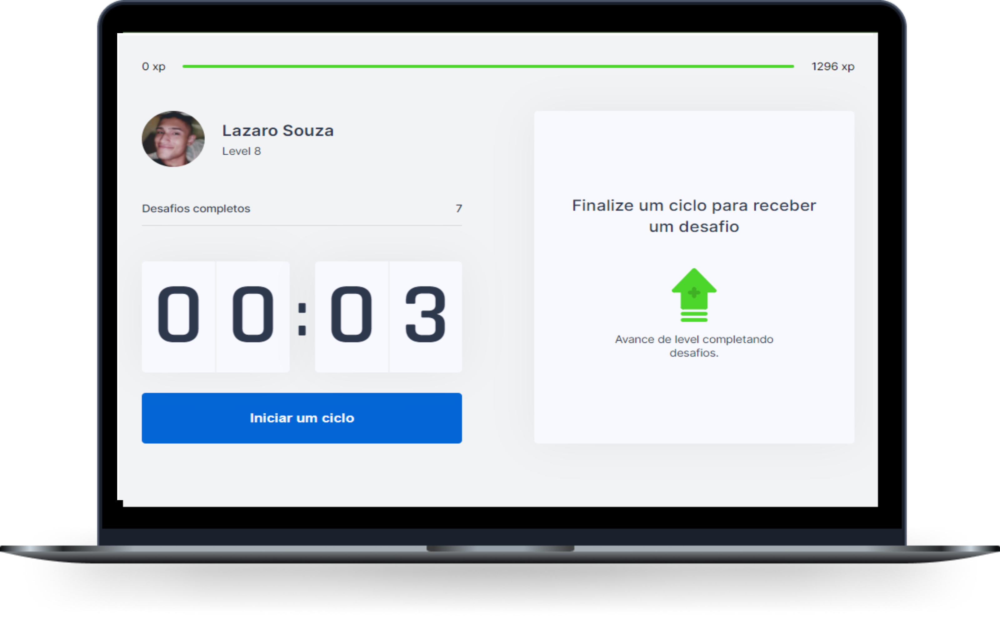
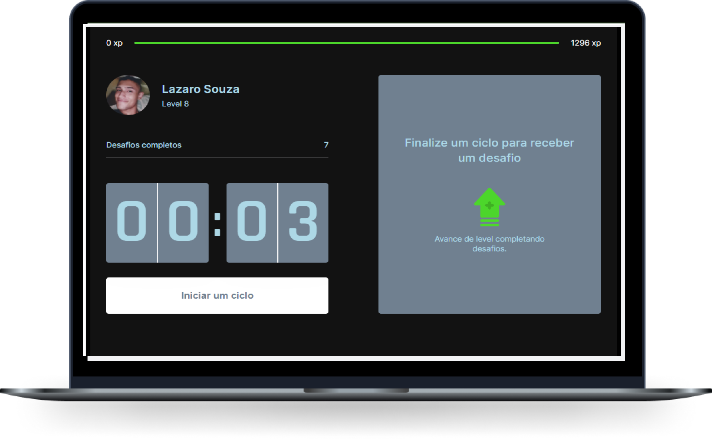

 
<h1 align="center">
  
</h1>
 

  <a href="#tecnologias">Tecnologias</a>&nbsp;&nbsp;&nbsp;|&nbsp;&nbsp;&nbsp;
  <a href="#projeto">Projeto</a>&nbsp;&nbsp;&nbsp;|&nbsp;&nbsp;&nbsp;
  <a href="#executar">Execução</a>

 
                     

           

                                                         
<h2 id="projeto"> ☄️ Projeto </h2>
O Move.it é uma aplicação baseada na técnica de Pomodoro, onde você estuda determinada quantidade de tempo, geralmente 25 minutos, e faz uma pausa de 5 minutos, ou 10 minutos em caso de 50 minutos de estudos. A aplicação têm o propósito de além de marcar o timmer utilizando estados do React, prover exercícios e uma forma de pontuação em níveis. Eu implementei um switch de tema com o React Switch e usei styled components pra definir e modiicar algumas das cores globais.
 

<h2 id="telas"> 💻 Telas </h2>

<h2 Principais aprendizados :bow:
* React com NextJS
* ContextAPI
* Styled Components
</h2>
                                                                   
<h2 id="tecnologias">
🚀 Tecnologias
</h2>
                    
- React + NextJS
- ContextAPI
- Styled Components
- Cookies 

<h2 id="executar">👨🏻‍💻 Executar</h2>
                                                                                                                
### Clonar o repositório na sua máquina.
#### Navegar para a pasta moveit-next e instalar o Node. Para tal, siga com o comando cd ./moveit-next e execute :
~~~javascript
yarn add node
~~~
#### Siga com o comando cd ./moveit-next execute, depois digite um dos seguintes comandos : 
~~~ javascript
yarn dev
~~~~

### Instrutor: O própio CTO da [Rocketseat](https://rocketseat.com.br/) :rocket: Diego

## :pencil2: Autor
Lazaro Souza :runner:  
Entusiasta na arte de aprender algo do zero 
Cursando Superior de Tecnologia em Análise e Desenvolvimento de Sistemas :books: (2020-2022) 

https://www.linkedin.com/in/lazarok09
### Aprenda a usar o [markdown](https://docs.pipz.com/central-de-ajuda/learning-center/guia-basico-de-markdown#open) no seu GitHub
#### Use [emojis](https://github.com/ikatyang/emoji-cheat-sheet) no seu readme :art:

< / :heart: >

